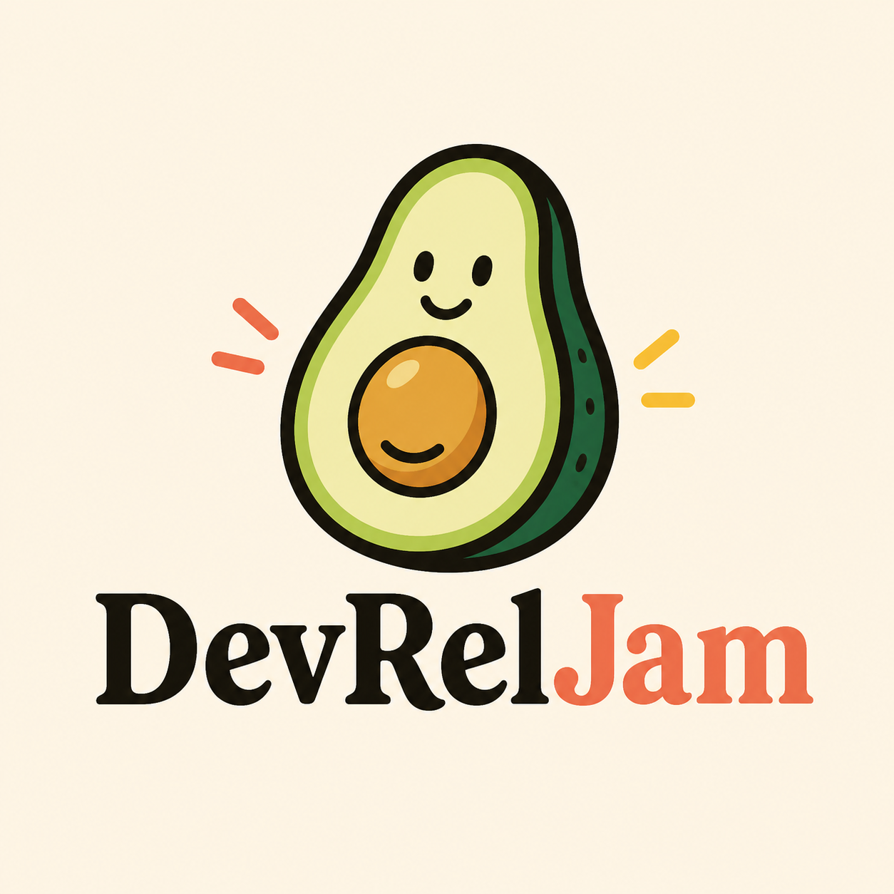

<!-- AUTO-GENERATED: Edit DevRelJam/devreljam.github.io public/data/*.json, then run .github/scripts/generate-profile-readme.mjs. -->

  

# DevRelJam

Developer Relations, in real conversations.

A practitioner-first community where DevRel folks jam on what worked, what didn't, and what we're learning while building developer communities.

  
  
  
  

## What Is DevRelJam?

DevRelJam is a first-of-its-kind meetup series for Developer Relations professionals and adjacent community builders. It is not a generic tech meetup; the room is built for people who have shipped programs, worked with developer audiences, and want sharper peer conversations.

Each Jam is intentionally practical: small enough for honest exchange, structured enough to leave with useful ideas, and timed around major tech gatherings so participation is easier for travelling DevRel teams.

## What Makes A Jam Different?

- **Peer-led:** Sessions prioritize field notes, lessons learned, and candid discussion over polished vendor talks.
- **Experienced:** Built for DevRel practitioners, community leads, advocates, program managers, and people in adjacent roles.
- **Conf-adjacent:** Jams happen when the right people are already in town, making high-quality hallway conversations easier.

## Up Next

### DevRelJam Singapore - September 2026

| Detail | Information |
| --- | --- |
| Date | Tuesday, September 29, 2026 |
| Time | 6:00 PM - 9:00 PM Singapore Time |
| Location | Singapore |
| Status | Open |
| Register | [Luma event](https://luma.com/wnygmi8l) |
| Repo | [SG-SEP-2026](https://github.com/DevRelJam/SG-SEP-2026) |

Join DevRel practitioners for a focused evening of peer-led sessions, an Ask Me Anything block, and practical conversations about developer advocacy, community, and engagement.

**Agenda**

- Welcome note
- Two practitioner sessions
- Ask Me Anything discussion
- Closing remarks and community time

## Where We Jam

Mapped across cities where DevRel teams gather.

| City | Status | Detail |
| --- | --- | --- |
| Singapore | Past and upcoming editions | February 2026 and September 2026 |
| Bengaluru | Past editions | April 2025, September 2025, and April 2026 |

## Public Repos

- [devreljam.github.io](https://github.com/DevRelJam/devreljam.github.io): the config-driven website for [devreljam.space](https://devreljam.space).
- [jam-template](https://github.com/DevRelJam/jam-template): reusable structure for new city editions.
- Past Jam repos: source-of-truth playbooks, agendas, and references for earlier editions.

## Past Jams

Where the room has already gathered.

| Jam | Date | Location | Repo | Luma |
| --- | --- | --- | --- | --- |
| [DevRelJam Bengaluru - April 2026](https://github.com/DevRelJam/BLR-APR-2026) | April 23, 2026 | Bengaluru, India | [Repo](https://github.com/DevRelJam/BLR-APR-2026) | [Luma](https://luma.com/bg8edxm7) |
| [DevRelJam Singapore - February 2026](https://github.com/DevRelJam/SG-FEB-2026) | February 26, 2026 | Figma Singapore | [Repo](https://github.com/DevRelJam/SG-FEB-2026) | [Luma](https://luma.com/248dtdi3) |
| [DevRelJam Bengaluru - September 2025](https://github.com/DevRelJam/BLR-SEP-2025) | September 17, 2025 | Bengaluru, India | [Repo](https://github.com/DevRelJam/BLR-SEP-2025) | [Luma](https://luma.com/t2yy3srv) |
| [DevRelJam Bengaluru - April 2025](https://github.com/DevRelJam/BLR-APR-2025) | April 22, 2025 | Bengaluru, India | [Repo](https://github.com/DevRelJam/BLR-APR-2025) | [Luma](https://luma.com/n9xptnma) |

## Featured People

Past Jams have brought together DevRel leaders, developer advocates, community builders, program managers, and technical marketing practitioners across the ecosystem.

| Speaker | Role | Jam |
| --- | --- | --- |
| [Annie Mathew](https://www.linkedin.com/in/annpmathew/) | Founder and Executive Director, Pivot Project | Singapore February 2026 |
| [Donnie Prakoso](https://www.linkedin.com/in/donnieprakoso) | Principal Developer Advocate, AWS | Singapore February 2026 |
| [Thu Ya Kyaw](https://www.linkedin.com/in/thuyakyaw/) | Senior Developer Relations Engineer, Google | Singapore February 2026 |
| [Atsushi Nakatsugawa](https://www.linkedin.com/in/goofmint/) | Developer Advocate, CodeRabbit | Bengaluru April 2026 |
| [Nimit Savant](https://www.linkedin.com/in/nimitsavant/) | Developer Evangelist, DevRev | Bengaluru April 2026 |
| [Mary Grygleski](https://www.linkedin.com/in/mary-grygleski/) | Vice President, AI Collective | Bengaluru April 2026 |
| [Brian Benz](https://www.linkedin.com/in/brianbenz/) | Principal AI Advocate, Microsoft | Bengaluru April 2026 |
| [Ben Greenberg](https://www.linkedin.com/in/hummusonrails/) | Senior Developer Relations Engineer, Arbitrum | Bengaluru September 2025 |

## Get Involved

- **Attend:** RSVP from the [DevRelJam Luma calendar](https://luma.com/devreljam).
- **Speak:** Submit field-tested lessons through [Sessionize](https://sessionize.com/devreljam/).
- **Host:** Start from the [Jam template](https://github.com/DevRelJam/jam-template) and adapt it to your city.
- **Follow along:** Watch this organization and share what would make the next Jam more useful.

## Code Of Conduct

DevRelJam is committed to a welcoming and inclusive environment. Please review the [Code of Conduct](https://github.com/DevRelJam/.github/blob/main/CODE_OF_CONDUCT.md) before participating in community spaces.

## Contact

DevRelJam is an initiative by [Yashraj Nayak](https://www.linkedin.com/in/yashrajnayak).
